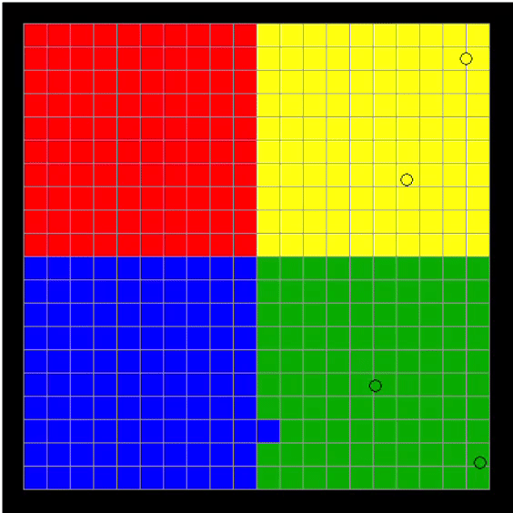

  

# Ball Game
In this "game" colored balls are shot on a game board to repaint the opponents squares. This is all done using the `tkinter` library.

## Collisions
A big focus was put into the fast collision detection between the balls and squares. 
The [`intersection_calculation.pdf`](intersection_calculation.pdf) goes into greater detail about this.